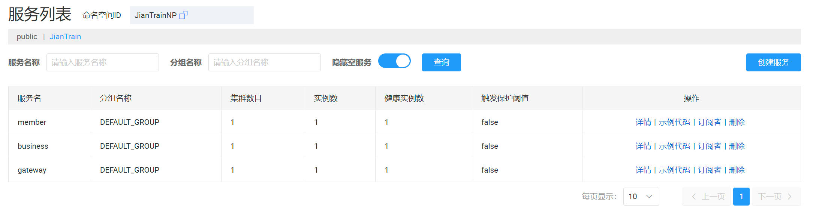

# 【JianTrain】Nacos整合


本项目使用 Nacos 作为配置中心和注册中心。

## 配置中心

### pom文件

```XML
<!-- 配置中心 -->
<dependency>
    <groupId>com.alibaba.cloud</groupId>
    <artifactId>spring-cloud-starter-alibaba-nacos-config</artifactId>
</dependency>
```

### SpringCloud配置

`bootstrap.properties`

```properties
# nacos server 地址
spring.cloud.nacos.server-addr=127.0.0.1:8848
# 启动环境，dataId为 member-dev.properties
spring.profiles.active=dev
# 应用名
spring.application.name=member
# 配置中心文件后缀，默认 properties
spring.cloud.nacos.config.file-extension=properties
```

### 新建配置


需要试试刷新，需要添加 `@RefreshScope` 注解。

### 启动


### 命名空间做项目隔离


在 `bootstrap.properties` 添加：

```XML
spring.cloud.nacos.config.namespace=JianTrainNP
```

## 注册中心

### 添加依赖

```XML
<!-- 注册中心 -->
<dependency>
    <groupId>com.alibaba.cloud</groupId>
    <artifactId>spring-cloud-starter-alibaba-nacos-discovery</artifactId>
</dependency>
```

### 配置

```properties
spring.cloud.nacos.discovery.server-addr=127.0.0.1:8848
spring.cloud.nacos.discovery.namespace=JianTrainNP
```



