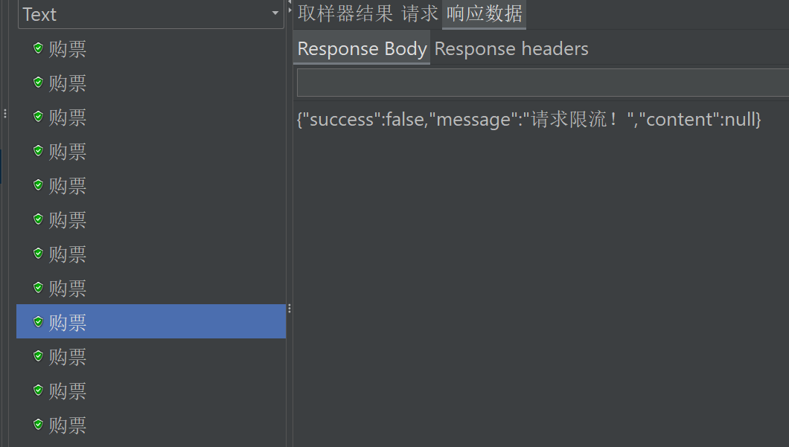
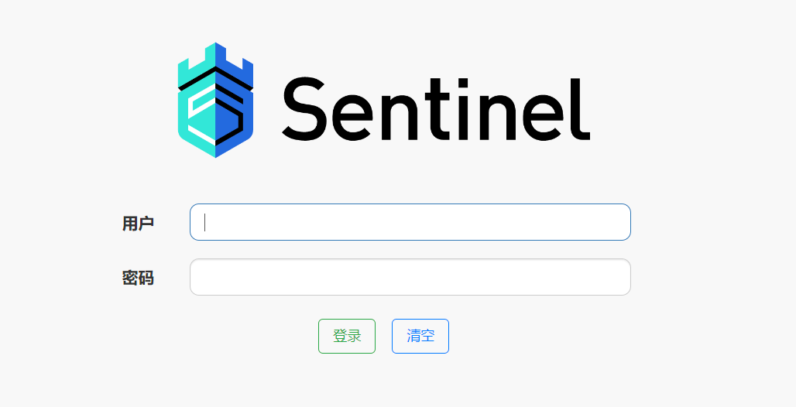
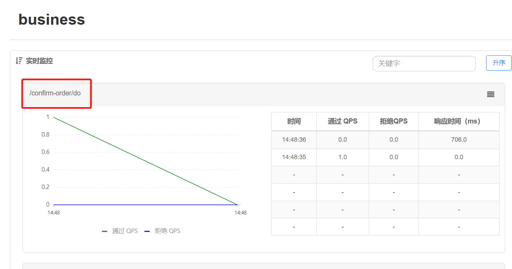

# 【JianTrain】Sentinal限流降级和熔断降级

## 常见的限流算法

1. 静态窗口限流
2. 动态窗口限流
3. 漏桶限流
4. 令牌桶限流
5. 令牌大闸

> 限流：做在被调用方
>
> 熔断：做在调用方

## 流控基本操作步骤

### 依赖

```XML
<dependency>
    <groupId>com.alibaba.cloud</groupId>
    <artifactId>spring-cloud-starter-alibaba-sentinel</artifactId>
</dependency>
```

### 限流方法（资源）加注解

```JAVA
@SentinelResource("doConfirm")
public void doConfirm(ConfirmOrderDoReq req) {...}
```

### 流控规则定义

在启动类中：

```JAVA
private static void initFlowRules(){
    List<FlowRule> rules = new ArrayList<>();
    FlowRule rule = new FlowRule();
    rule.setResource("doConfirm");
    rule.setGrade(RuleConstant.FLOW_GRADE_QPS);
    // Set limit QPS to 20.
    rule.setCount(1);
    rules.add(rule);
    FlowRuleManager.loadRules(rules);
}
```

并在启动后调用：

```JAVA
public static void main(String[] args) {
    SpringApplication app = new SpringApplication(BusinessApplication.class);
    Environment env = app.run(args).getEnvironment();
    LOG.info("启动成功！！");
    LOG.info("测试地址: \thttp://127.0.0.1:{}{}/hello", env.getProperty("server.port"), env.getProperty("server.servlet.context-path"));
    initFlowRules();
}
```

### 添加限流拦截器

一旦请求被 sentinel 限流了，调用该方法：

```JAVA
/**
* 降级方法，需包含限流方法的所有参数和BlockException参数
* @param req
* @param e
*/
public void doConfirmBlock(ConfirmOrderDoReq req, BlockException e) {
	LOG.info("购票请求被限流：{}", req);
	throw new BusinessException(BusinessExceptionEnum.CONFIRM_ORDER_FLOW_EXCEPTION);
}
```

并修改注解：`@SentinelResource(value = "doConfirm", blockHandler = "doConfirmBlock")`



## 控台界面

```JAVA
java -Dserver.port=18080 -jar sentinel-dashboard-1.8.6.jar
```



在项目的配置中，添加配置：

```properties
spring.cloud.sentinel.transport.port=8719
spring.cloud.sentinel.transport.dashboard=18080
```



## 流控规则持久化-Nacos

### 依赖

