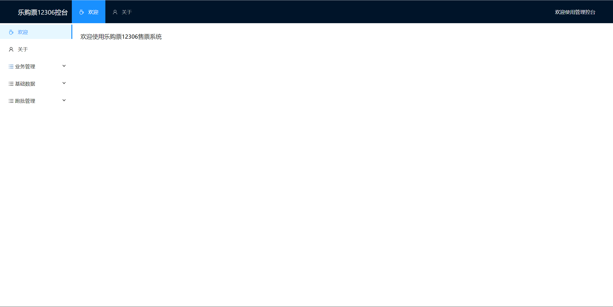

# 【JianTrain】乐购票12306系统

## 技术栈

前端技术栈：

- Vue CLI 5
- Axios

后端技术栈：

- **SpringBoot3**、**SpringCloud Alibaba**、**JDK17**
- **Nacos**：注册中心、配置中心
- **Seata**：分布式事务
- **Sentinel**：限流降级
- **OpenFeign**：远程服务调用
- **Redis**：缓存
- **Mysql**：数据库
- **RocketMQ**：消息队列
- **Quartz**：定时任务
- **Mybatis**：持久层框架

## QuickStart

### 拉取项目到本地

````
git clone https://github.com/SongJianHIT/train.git
````

### 用户前端页面启动

在 `/web` 文件夹下执行：

```bash
# 安装环境
npm install
# 运行脚本
npm run serve-dev
```


## 控台前端页面启动

在 `/admin` 文件夹下执行：

```bash
# 安装环境
npm install
# 运行脚本
npm run admin-dev
```


