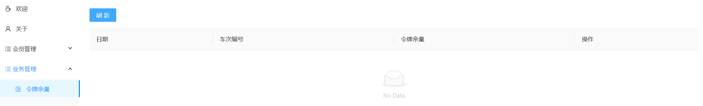

# 【JianTrain】令牌大闸

## 为什么要引入令牌大闸？

- 分布式锁和限流都不能解决 **机器人刷票** 问题，1000个请求抢票，900个限流快速失败，另外100个有可能是同一个人在刷票
- 没有余票时，需要查库才能知道没有票，会影响性能，不如查令牌余量来的快

## 设计方案

### 数据库表设计

关键点在于：**日期 + 车次编号 + 令牌余量**

令牌是与车次相关的，因此可以在生成每日车次数据的时候，同时初始化令牌。