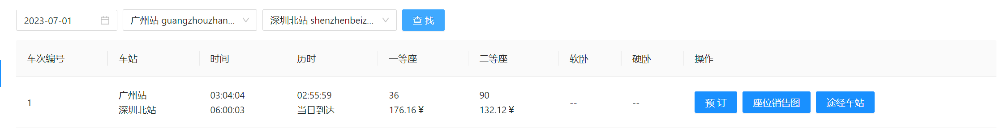
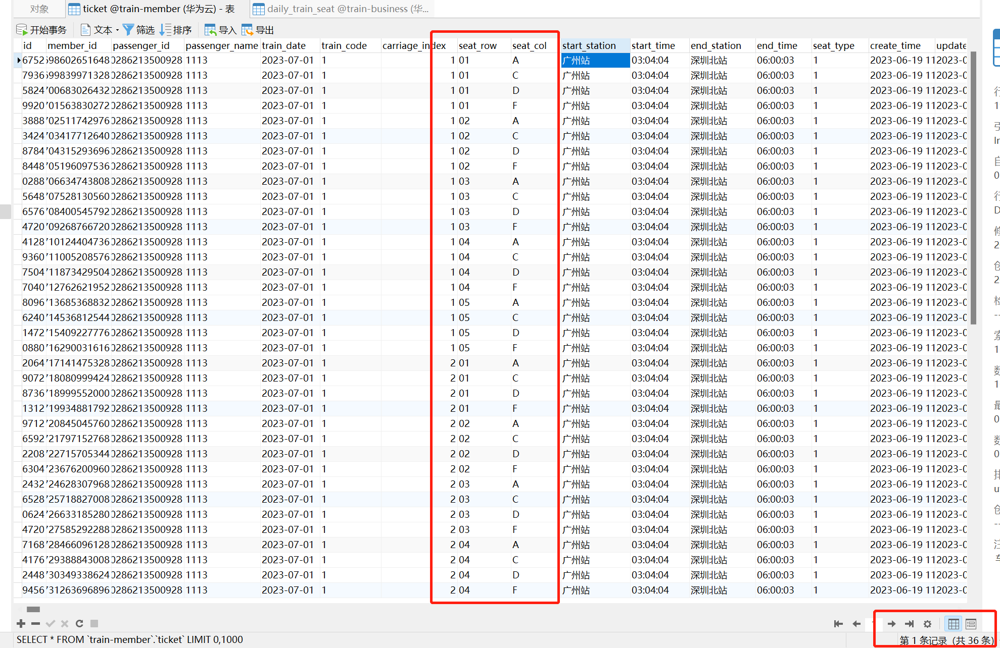

# 【JianTrain】分布式锁解决库存超卖

## 现有的问题

使用 JMeter 对当前系统进行压测。

对这个车次进行测试：




Jmeter 的设置：


我们尝试 500 人抢购一等座，一等座只有36个，看看会不会超卖。


同一个座位卖给多个人，超卖。

## 超卖原因

假设库存为 1，多个线程同时读取余票记录，都认为库存为 1，就都往后去选座购票，最终导致超卖。

## 怎么解决

### 解决方法一：Synchronized

在购票 service 上增加同步关键字，使其串行化执行。

局限：仅限于单机



成功解决超卖！

### 解决方法二：Redis分布式锁

Redis 提供了：

- `SETNX`：添加某个 key，但只有这个 key 不存在的时候，才能添加进入
- 对应的java接口：`redisTemplate.opsForValue().setIfAbsent()`

```JAVA
// 获取分布式锁
String lockKey = RedisKeyPreEnum.CONFIRM_ORDER + "-" + DateUtil.formatDate(dto.getDate()) + "-" + dto.getTrainCode();
// setIfAbsent就是对应redis的setnx
Boolean setIfAbsent = redisTemplate.opsForValue().setIfAbsent(lockKey, lockKey, 10, TimeUnit.SECONDS);
if (Boolean.TRUE.equals(setIfAbsent)) {
	LOG.info("恭喜，抢到锁了！lockKey：{}", lockKey);
} else {
	// 只是没抢到锁，并不知道票抢完了没，所以提示稍候再试
	// LOG.info("很遗憾，没抢到锁！lockKey：{}", lockKey);
	// throw new BusinessException(BusinessExceptionEnum.CONFIRM_ORDER_LOCK_FAIL);

	LOG.info("没抢到锁，有其它消费线程正在出票，不做任何处理");
	return;
}
```

并且，在方法的最后，需要主动释放锁：

```JAVA
finally {
    // try finally不能包含加锁的那段代码，否则加锁失败会走到finally里，从而释放别的线程的锁
    LOG.info("购票流程结束，释放锁！lockKey：{}", lockKey);
    redisTemplate.delete(lockKey);
    // LOG.info("购票流程结束，释放锁！");
    // if (null != lock && lock.isHeldByCurrentThread()) {
    //     lock.unlock();
    // }
}
```


解决了超卖，但是买的很慢！**但实际生产项目不会用这个！** 原因是key过期的时间不好把控，有可能逻辑耗时过长，导致key过期。

### 针对上述问题：Redission看门狗防止key过期

使用守护线程，监控 key 的过期时间，达到一定阈值自动延长时间。

 ```JAVA
 // 使用redisson，自带看门狗
 lock = redissonClient.getLock(lockKey);
 boolean tryLock = lock.tryLock(0, TimeUnit.SECONDS); // 自带看门狗
 if (tryLock) {
     LOG.info("恭喜，抢到锁了！");
  else {
     // 只是没抢到锁，并不知道票抢完了没，所以提示稍候再试
     LOG.info("很遗憾，没抢到锁");
     throw new BusinessException(BusinessExceptionEnum.CONFIRM_ORDER_LOCK_FAIL);
 }
 ```

