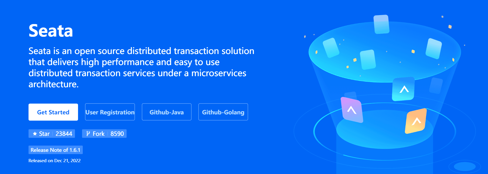
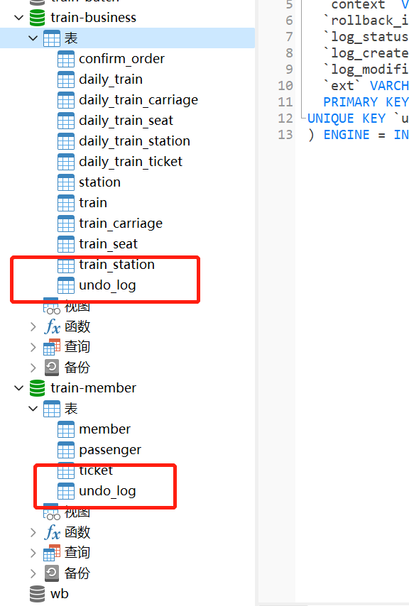
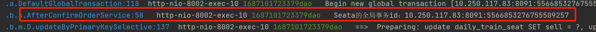
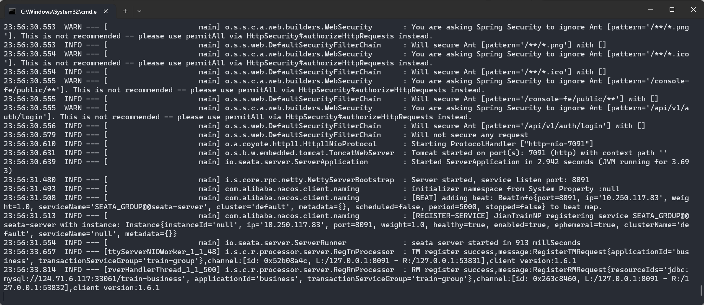
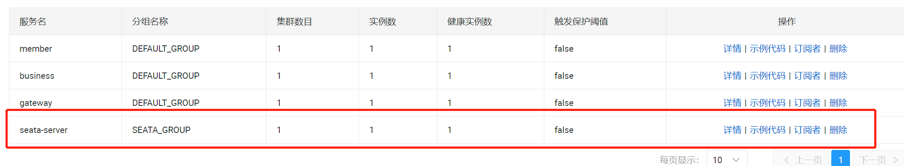

# 【JianTrain】整合Seata分布式事务



Seata 四种模式：

- **AT 模式**：默认，简单，需要添加 undo_log 表，反向生成 SQL，性能高
- **TCC 模式**：try confirm / cancel，三阶段的代码都需要自己实现，Seata只负责调用
  - 对业务代码侵入性强，必要时需要修改数据库
- **SAGA 模式**：长事务解决方案，需要程序员自己编写两阶段代码
  - 基于状态机来实现的，需要一个 JSON 文件，可异步执行
- **XA 模式**：强一致性场景

## 基本使用

### 创建UndoLog

```SQL
CREATE TABLE `undo_log` (
	`id` BIGINT ( 20 ) NOT NULL AUTO_INCREMENT,
	`branch_id` BIGINT ( 20 ) NOT NULL,
	`xid` VARCHAR ( 100 ) NOT NULL,
	`context` VARCHAR ( 128 ) NOT NULL,
	`rollback_info` LONGBLOB NOT NULL,
	`log_status` INT ( 11 ) NOT NULL,
	`log_created` datetime NOT NULL,
	`log_modified` datetime NOT NULL,
	`ext` VARCHAR ( 100 ) DEFAULT NULL,
	PRIMARY KEY ( `id` ),
UNIQUE KEY `ux_undo_log` ( `xid`, `branch_id` ) 
) ENGINE = INNODB AUTO_INCREMENT = 1 DEFAULT CHARSET = utf8;
```



### 导入依赖

```XML
<dependency>
    <groupId>com.alibaba.cloud</groupId>
    <artifactId>spring-cloud-starter-alibaba-seata</artifactId>
</dependency>
```

### 配置

```properties
# 事务组名称
seata.tx-service-group=train-group
# 事务组与seata集群的关联
seata.service.vgroup-mapping.train-group=default
# seata集群对应的机器
seata.service.grouplist.default=127.0.0.1:8091
```

### 加注解

在每个需要分布式事务的 service 方法上加上 `@GlobalTransactional` 注解。



## Seata + Nacos

### 配置

在 seata 的conf下，修改application.yml

```yaml
seata:
  config:
    # support: nacos, consul, apollo, zk, etcd3
    # type: file
    type: nacos
    nacos:
      server-addr: 127.0.0.1:8848
      namespace: JianTrain
      group: SEATA_GROUP
      username: nacos
      password: nacos
      context-path:
      ##if use MSE Nacos with auth, mutex with username/password attribute
      #access-key:
      #secret-key:
      data-id: seataServer.properties
  registry:
    # support: nacos 、 eureka 、 redis 、 zk  、 consul 、 etcd3 、 sofa
    type: nacos
    nacos:
      application: seata-server
      server-addr: 127.0.0.1:8848
      group: SEATA_GROUP
      namespace: JianTrain
      cluster: default
      username: nacos
      password: nacos
      context-path:
      ##if use MSE Nacos with auth, mutex with username/password attribute
      #access-key:
      #secret-key:
```



开启成功：

