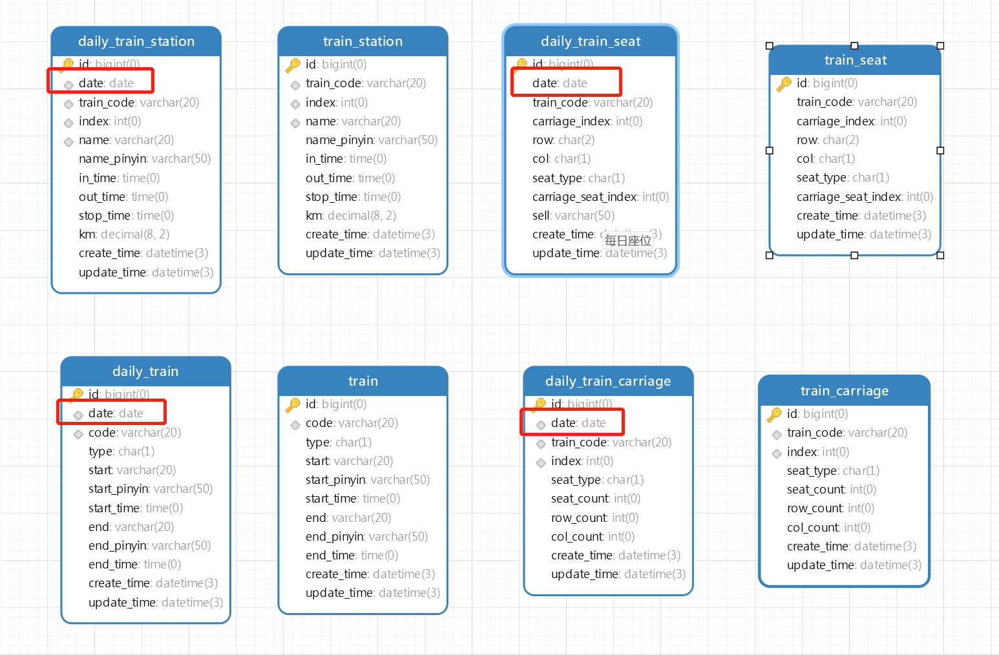
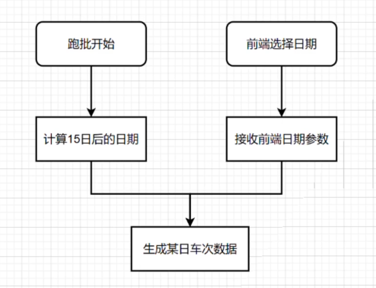
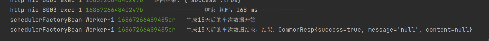

# 【JianTrain】每日火车数据生成

> 使用技术：
>
> - 定时任务框架 **Quartz**
> - 远程服务调用 **Feign**

前面已经完成了 **火车基础数据** 的维护，这些基础数据与日期是无关的（至少不会频繁发生变化），因此我们可以直接根据火车的基础数据，定时生成火车的每日火车数据，而无需手工生成。

## 数据库设计



新创建四张 `daily_` 表，在原先的火车基础数据上添加一个新的列 `date`，用于存储当前日期。

## 基本的增删改查

不再赘述。

## 定时任务生成每日车次数据

定时任务逻辑：



可以看到分为两条线：

- 自动定时跑批。需要计算15天后的日期，对其生成。
- 手动补偿任务。从前端传入指定日期，生成对应数据。

### 定时跑批

定时任务依赖：

```xml
<!--SpringBoot自带定时任务-->
<dependency>
    <groupId>org.springframework.boot</groupId>
    <artifactId>spring-boot-starter-quartz</artifactId>
</dependency>
```

创建一个任务类，重写 execute 方法，完成跑批逻辑：

```JAVA
@DisallowConcurrentExecution
public class DailyTrainJob implements Job {

    private static final Logger LOG = LoggerFactory.getLogger(DailyTrainJob.class);

    /**
     * 远程服务调用接口
     */
    @Resource
    BusinessFeign businessFeign;

    /**
     * 定时任务逻辑
     * @param jobExecutionContext
     * @throws JobExecutionException
     */
    @Override
    public void execute(JobExecutionContext jobExecutionContext) throws JobExecutionException {
        // 增加日志流水号
        MDC.put("LOG_ID", System.currentTimeMillis() + RandomUtil.randomString(3));
        LOG.info("生成15天后的车次数据开始");
        // 计算15天后的日期
        Date date = new Date();
        DateTime dateTime = DateUtil.offsetDay(date, 15);
        Date offsetDate = dateTime.toJdkDate();
        // 通过 feign 调用 business 的服务
        CommonResp<Object> commonResp = businessFeign.genDaily(offsetDate);
        LOG.info("生成15天后的车次数据结束，结果：{}", commonResp);
    }
}
```

远程服务调用依赖：

```xml
<!--远程调用openfeign-->
<dependency>
    <groupId>org.springframework.cloud</groupId>
    <artifactId>spring-cloud-starter-openfeign</artifactId>
</dependency>
```

**FeignClient 客户端接口类**。注解里面的 `name` 对应的是服务的 `spring.application.name` 配置的内容，如果添加了 Nacos，这里就不需要写 `url` 了。

```java
// @FeignClient 声明这是一个 Feign 客户端，要向服务端发请求
@FeignClient(name = "business", url = "http://127.0.0.1:8002/business")
public interface BusinessFeign {

    @GetMapping("/hello")
    String hello();

    @GetMapping("/admin/daily-train/gen-daily/{date}")
    CommonResp<Object> genDaily(@PathVariable @DateTimeFormat(pattern = "yyyy-MM-dd") Date date);
}
```

最后在启动类中添加注解，并指定 feign 包路径：

```java
@EnableFeignClients("tech.songjian.train.batch.feign")
public class BatchApplication {
    //....省略
}
```



