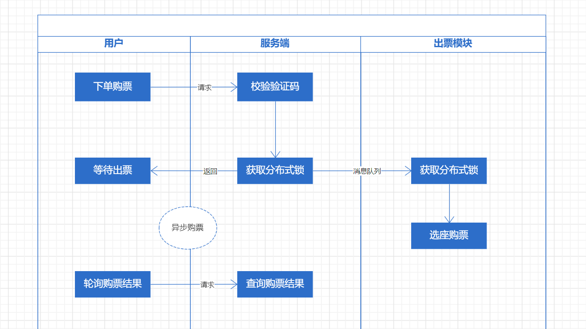
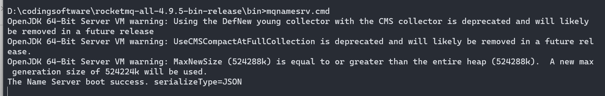
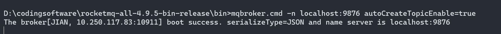

# 【JianTrain】消息队列异步削峰

> 1. 使用 MQ 将购票流程一分为二
>    - 校验、拿锁成功后就返回
>    - 异步执行购票逻辑
> 2. 增加排队购票功能



## RocketMQ


下载地址：https://rocketmq.apache.org/release-notes/2023/03/26/4.9.5

控台下载：https://rocketmq.apache.org/release-notes/2021/09/23/release-notes-rocketmq-dashboard-1.0.0

### 配置环境变量

```
ROCKETMQ_HOME="D:\rocketmq"
NAMESRV_ADDR="localhost:9876"
```

### 启动server

```
mqnamesrv.cmd
```



### 启动broker

```
mqbroker.cmd -n localhost:9876 autoCreateTopicEnable=true
```



### 启动控台

记得要在启动时添加 JVM 参数：

```
-Drocketmq.namesrv.addr=127.0.0.1:9876
```


## 发送消息

