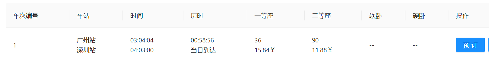

# 【JianTrain】订票功能

## 余票维护

### 车票数据库表设计

这个表不应该手动维护，而是：

- 新增：根据每日车次信息，自动跑批生成数据
- 修改：根据售卖情况，同步修改数据


控台只是用来看的，不能直接修改！

### 业务实现

**问题一：什么时候生成这张表的数据？**

- 应该在生成每次车次跑批的时候，同步生成表数据。

**问题二：数据从哪里来？**

- 出发站、到达站信息可以通过嵌套循环实现，如：

  `[A, B, C]` 可以通过嵌套循环，生成所有出发-到达的组合：`[AB, AC, BC]`

- 各个座次的余票信息，可以通过每日座位表来进行统计

业务代码逻辑实现：还是一样，先删除后新增。

```JAVA
	@Transactional
    public void genDaily(DailyTrain dailyTrain, Date date, String trainCode) {
        LOG.info("生成日期【{}】车次【{}】的余票信息开始", DateUtil.formatDate(date), trainCode);

        // 删除某日某车次的余票信息
        DailyTrainTicketExample dailyTrainTicketExample = new DailyTrainTicketExample();
        dailyTrainTicketExample.createCriteria()
                .andDateEqualTo(date)
                .andTrainCodeEqualTo(trainCode);
        dailyTrainTicketMapper.deleteByExample(dailyTrainTicketExample);

        // 查出某车次的所有的车站信息
        List<TrainStation> stationList = trainStationService.selectByTrainCode(trainCode);
        if (CollUtil.isEmpty(stationList)) {
            LOG.info("该车次没有车站基础数据，生成该车次的余票信息结束");
            return;
        }

        DateTime now = DateTime.now();
        for (int i = 0; i < stationList.size(); i++) {
            // 得到出发站
            TrainStation trainStationStart = stationList.get(i);
            BigDecimal sumKM = BigDecimal.ZERO;
            for (int j = (i + 1); j < stationList.size(); j++) {
                TrainStation trainStationEnd = stationList.get(j);
                sumKM = sumKM.add(trainStationEnd.getKm());

                DailyTrainTicket dailyTrainTicket = new DailyTrainTicket();
                dailyTrainTicket.setId(SnowUtil.getSnowflakeNextId());
                dailyTrainTicket.setDate(date);
                dailyTrainTicket.setTrainCode(trainCode);
                dailyTrainTicket.setStart(trainStationStart.getName());
                dailyTrainTicket.setStartPinyin(trainStationStart.getNamePinyin());
                dailyTrainTicket.setStartTime(trainStationStart.getOutTime());
                dailyTrainTicket.setStartIndex(trainStationStart.getIndex());
                dailyTrainTicket.setEnd(trainStationEnd.getName());
                dailyTrainTicket.setEndPinyin(trainStationEnd.getNamePinyin());
                dailyTrainTicket.setEndTime(trainStationEnd.getInTime());
                dailyTrainTicket.setEndIndex(trainStationEnd.getIndex());
                int ydz = dailyTrainSeatService.countSeat(date, trainCode, SeatTypeEnum.YDZ.getCode());
                int edz = dailyTrainSeatService.countSeat(date, trainCode, SeatTypeEnum.EDZ.getCode());
                int rw = dailyTrainSeatService.countSeat(date, trainCode, SeatTypeEnum.RW.getCode());
                int yw = dailyTrainSeatService.countSeat(date, trainCode, SeatTypeEnum.YW.getCode());
                // 票价 = 里程之和 * 座位单价 * 车次类型系数
                String trainType = dailyTrain.getType();
                // 计算票价系数：TrainTypeEnum.priceRate
                BigDecimal priceRate = EnumUtil.getFieldBy(TrainTypeEnum::getPriceRate, TrainTypeEnum::getCode, trainType);
                BigDecimal ydzPrice = sumKM.multiply(SeatTypeEnum.YDZ.getPrice()).multiply(priceRate).setScale(2, RoundingMode.HALF_UP);
                BigDecimal edzPrice = sumKM.multiply(SeatTypeEnum.EDZ.getPrice()).multiply(priceRate).setScale(2, RoundingMode.HALF_UP);
                BigDecimal rwPrice = sumKM.multiply(SeatTypeEnum.RW.getPrice()).multiply(priceRate).setScale(2, RoundingMode.HALF_UP);
                BigDecimal ywPrice = sumKM.multiply(SeatTypeEnum.YW.getPrice()).multiply(priceRate).setScale(2, RoundingMode.HALF_UP);
                dailyTrainTicket.setYdz(ydz);
                dailyTrainTicket.setYdzPrice(ydzPrice);
                dailyTrainTicket.setEdz(edz);
                dailyTrainTicket.setEdzPrice(edzPrice);
                dailyTrainTicket.setRw(rw);
                dailyTrainTicket.setRwPrice(rwPrice);
                dailyTrainTicket.setYw(yw);
                dailyTrainTicket.setYwPrice(ywPrice);
                dailyTrainTicket.setCreateTime(now);
                dailyTrainTicket.setUpdateTime(now);
                dailyTrainTicketMapper.insert(dailyTrainTicket);
            }
        }
        LOG.info("生成日期【{}】车次【{}】的余票信息结束", DateUtil.formatDate(date), trainCode);

    }
```

完成之后，我们把这个逻辑添加到跑批任务中：

> 注意：事务的传递机制。

```JAVA
	/**
     * 生成指定日期指定车次的当日火车数据
     * @param date
     * @param train
     */
    @Transactional
    public void genDailyTrain(Date date, Train train) {
        LOG.info("生成日期【{}】车次【{}】的信息开始", DateUtil.formatDate(date), train.getCode());
        // 删除该车次已有的数据
        DailyTrainExample dailyTrainExample = new DailyTrainExample();
        dailyTrainExample.createCriteria()
                .andDateEqualTo(date)
                .andCodeEqualTo(train.getCode());
        dailyTrainMapper.deleteByExample(dailyTrainExample);

        // 生成该车次的数据
        DateTime now = DateTime.now();
        DailyTrain dailyTrain = BeanUtil.copyProperties(train, DailyTrain.class);
        // 雪花算法生成 id
        dailyTrain.setId(SnowUtil.getSnowflakeNextId());
        dailyTrain.setCreateTime(now);
        dailyTrain.setUpdateTime(now);
        dailyTrain.setDate(date);
        dailyTrainMapper.insert(dailyTrain);

        // 生成该车次的车站数据
        dailyTrainStationService.genDaily(date, train.getCode());

        // 生成该车次的车厢数据
        dailyTrainCarriageService.genDaily(date, train.getCode());

        // 生成该车次的座位数据
        dailyTrainSeatService.genDaily(date, train.getCode());

        // 生成该车次的余票数据
        dailyTrainTicketService.genDaily(dailyTrain, date, train.getCode());

        LOG.info("生成日期【{}】车次【{}】的信息结束", DateUtil.formatDate(date), train.getCode());
    }
```

## 选座购票功能

在余票查询的页面添加预定按钮，点击进入后跳转到余票详情页面（包括车次信息、票价、余票）



点击预定后：


在这个界面中就可以提交订单了！

需要完成上述页面，首先是要获取当前 member 的所有乘客。

### 查询当前用户绑定的乘客

```JAVA
	/**
     * 查 member 绑定的所有乘客
     * @return
     */
    @GetMapping("/query-mine")
    public CommonResp<List<PassengerQueryResp>> queryMine() {
        List<PassengerQueryResp> list = passengerService.queryMine();
        return new CommonResp<>(list);
    }
```

构造一个条件查询即可。

```JAVA
	/**
     * 查询我的所有乘客
     */
    public List<PassengerQueryResp> queryMine() {
        PassengerExample passengerExample = new PassengerExample();
        passengerExample.setOrderByClause("name asc");
        PassengerExample.Criteria criteria = passengerExample.createCriteria();
        // 需要从 ThreadLoacl 中获取 id
        criteria.andMemberIdEqualTo(LoginMemberContext.getId());
        List<Passenger> list = passengerMapper.selectByExample(passengerExample);
        return BeanUtil.copyToList(list, PassengerQueryResp.class);
    }
```

### 后端购票逻辑

> 12306 官方规则：
>
> - 只有全部是一等座或者全部是二等座的时候才能选座
> - 余票小于一定数量时，不支持选座

后端购票逻辑分为选座和不选座（以购买两张一等座AB为例）：

- 选座：遍历一等座车厢，每个车厢从 1 号座位开始找，未被购买的就选择
- 不选座：遍历一等座车厢，每个车厢从1号座位开始找A列座位，未被购买的，就预选中；再看旁边的B，如果满足就选，不满足就继续查AB。

**从第二个座位开始，需要计算和第一个座位的偏移值，可以减少循环！**