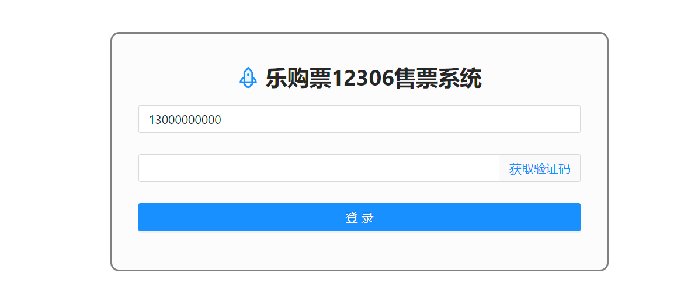

# <p align="center">JianTrain乐购票12306系统</p>
## 技术栈

前端技术栈：

- Vue CLI 5
- Axios

后端技术栈：

- **SpringBoot3**、**SpringCloud Alibaba**、**JDK17**
- **Nacos**：注册中心、配置中心
- **Seata**：分布式事务
- **Sentinel**：限流降级
- **OpenFeign**：远程服务调用
- **Redis**：缓存
- **Mysql**：数据库
- **RocketMQ**：消息队列
- **Quartz**：定时任务
- **Mybatis**：持久层框架

## QuickStart

### 前端页面

在 `web` 文件夹下执行：

```bash
# 安装环境
npm install
# 运行脚本
npm run serve-dev
```




